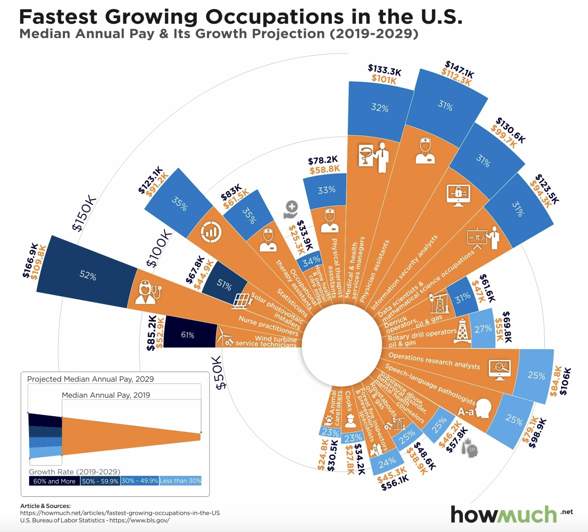
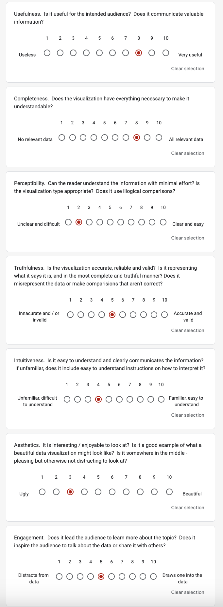

# Assignment 3 & 4: Critique by Design
The purpose of this assignment is to complete a workflow that is similar to the workflow of final project. We are tasked to find a visualization that needs improvement, critque it using Stephen Few's [Data Visualization Effectiveness Profile](http://www.perceptualedge.com/articles/visual_business_intelligence/data_visualization_effectiveness_profile.pdf), sketch possible solutions, share the skecthes with at least two people to get their feedback, and finally take the feedback you've received on your proposed solution, modify your design and then build a solution (using Flourish or Tableau). 

## Step One: find a data visualization (with data you can use!)
For this assignment, I used this data visualization, [Charting the 20 Top Growing U.S. Careers Based on Real Salary Projections](https://howmuch.net/articles/fastest-growing-occupations-in-the-US), from howmuch.net. This visualization is based on data from the [U.S. Bureau of Labor and Statistics](https://www.bls.gov/) regarding projected salary information in the next coming decade on the top 20 fastest growing careers in median salary in 2019. I chose this particular visualization because the type of visualization stood out to me since it was something that I was not familiar with, and since the job market is usually a topic of interest especially for those that are deciding what career field they want to enter or those that are looking for a career change. As I analyzed at the visualization more and read the article in depth, I realized that the story they are trying to tell is very simple, but the visualization used makes the story seem more complex, can mislead the audience without careful analysis, and there are several elements (which will be discussed later) that make the story harder to understand. The data was not available anymore on the U.S. Bureau of Labor Statistics since it is from 2019, and they update this data every year, but a data table with occupation, 2019 median pay (yearly), and growth rate (2019-2029) was provided on the howmuch.net website, but I was able to extract the 2029 projected median pay (yearly) from the visualization and create an excel file with the data. 

## Step Two: critique the data visualization
To critque the visualization, I first approached it from a stylistic standpoint where my initial observation was that their intention was to depict the data as a bar chart. However, instead of opting for the conventional format with clear x and y-axis labels, they employed a circular arrangement, reminiscent of a pie chart/donut, but there weren't even enough data points to complete the circular layout. Furthermore, when examining the bar sizes, I noticed inconsistencies between the percentages and their corresponding magnitudes. For instance, the largest percentage was 61%, yet it appeared smaller than some data points with smaller percentages, such as those at 31%. It wasn't until I examined the legend in the lower left-hand corner that I grasped that the size of the blue portion of each bar was irrelevant. Instead, it was the shade of blue that indicated the growth rate, with lighter shades signifying smaller percentages and darker shades representing larger ones. Additionally, as I delved deeper into the article, I realized how misleading the title was. Based on the title, one would assume that the chart showcased the fastest-growing occupations in terms of size (the number of people in each field). However, it actually depicted the fastest-growing occupations in terms of salary and projected salary growth. Also, I believe that organizing the occupations in hierarchical order of growth rate percentage when reading the visualization from left to right is a commendable approach to sorting the data. Nonetheless, it might not be immediately intuitive to the reader because the eyes are naturally drawn to the largest bars first, creating an initial impression that the visualization is disorderly when it is not. These points lead me to evaluate and provide a score for the inuitiveness, aesthetics, truthfulness, and perceptiblity portions of the Data Visualization Effectiveness Profile. 

In my view, the only aspect that functioned effectively was the legend, as it aided in understanding the significance of bar size and color, but without it, understanding the visualization would not be inuitive. On the other hand, for the completeness, usefulness, and engagement portions of the Data Visualization Effectiveness Profile I actually gave the visualization higher score because of who I thought the intended audience was. From my perspective, I thought the primary users of this tool would be students ranging from the final year of high school to the conclusion of their second year in college who are in the process of making crucial decisions regarding their academic field of study, choice of major, or future career path. Having access to information about which professions are experiencing growth in terms of salary can significantly help them in making informed decisions about their career path. Furthermore, I also believe this tool could also prove valuable to individuals working within the federal government because it has the potential to aid in the allocation of resources and funding by providing insights into which occupations or career require greater support due to their potential growth. However, the current visualization may not be particularly effective in communicating this information to the intended audience because if not examined closely, it has the potential to be misinterpreted. For instance, it may appear that nurse practitioners earn the highest salaries, but in reality, they do not exhibit the highest growth rate. Instead, wind turbine service technicians hold that distinction. I believe all the data given is necessary to make it understandable and learning about these statistics and create a call to action to the audience to learn more about these specific occupations, however there are several aspects need to be improved to avoid potential confusion among the audience. 

In reagrds to the method in evaluting the data, I found this approach to be effective in evaluating the chosen data visualization, especially when compared to the GoodCharts method. One significant advantage of this method is that it encompasses a more comprehensive set of criteria for assessment, featuring seven aspects to consider, whereas GoodCharts only covers two (design execution and contextual awareness). In the initial stages of evaluation, both methods record an initial reaction, listing what is liked and disliked, and identifying areas for potential improvement or desired changes. However, GoodCharts stands out by providing a structured critique with actionable recommendations because participants are required to describe three aspects they wish to change and provide explanations for how and why these changes would enhance the visualization. Although there may be more recommendations, having only three makes eases the implementation and does overwhelm the creator too much. I believe aspect of GoodCharts is particularly advantageous, and Data Visualization Effectiveness Profile could have something similar instead of just asking "What, if anything, would you do differently?". Additionally, 
Data Visualization Effectiveness Profile method would also incorporate elements that encourage thinking about the audience. This includes considerations of the primary audience and how effectively the visualization engages and serves them. After all, the audience is the ultimate target of any visualization, and this perspective adds depth to the evaluation process. In my opinion, there are a few key measures that could enhance the evaluation further. These additions or modifications could include:
**- Format/Type of Visualization:** Assessing whether the chosen visualization type is the most effective and suitable for representing the data. This consideration ensures that the chosen format aligns with the nature of the data and the intended message.
**- Simplicity:** Evaluating the simplicity of the visualization, as sometimes the most straightforward visualizations have the most significant impact. This measure would help identify instances where complexity is unnecessary for conveying a simple story.
**- Color Scale Evaluation:** Adding a measure to provide feedback on the color scale used in the visualization. This assessment would encompass whether all colors are necessary, whether the color choices are too harsh or result in poor contrast, and whether the colors effectively contribute to conveying the intended narrative.

In summary, while the Data Visualization Effectiveness Profile offers a more comprehensive approach to critiquing data visualizations and takes the audience into account, the GoodCharts evaluation method excels at creating an actionable plan for implementing suggested changes. Both approaches have their strengths and could potentially be used in conjunction for a thorough and actionable evaluation process. Using the Data Visualization Effectiveness Profile helped guide me in creating my sketches, but specifically made me focus on altering the main key elements below: 
**- change layout of the visualization to a simple bar chart, slope chart, or grouped bar plot**
**- eliminate the images associated with each occupation since they do not offer any additional information beyond a "cute" appeal**
**- solely on representing the growth rate as a percentage within the bars, but also exploring ways to incorporate salary data from both 2019 and 2029 such as an interactive component**
**- discard the blue-orange color contrast, instead highlight only the bar with the highest growth rate (make all the other bars grey) and only add a legend if necessary** 
**- revise the title to accurately reflect the data's main story**

For covenience, I added an image of my Data Visualization Effectiveness Profile ratings below so that a connection can be made between my insights stated above and ratings. 

## Step Three: sketch out a solution
After critiquing the visualization, I had three ideas in mind on how to redesign the visualization: a grouped bar chart, a slope chart, and a simple bar chart. I used flourish to create these sketches. 

Although the original visualization wanted to focus on providing the audience with information on the occupations salary in 2019, their projected salary in 2029, and the growth rate all within the visualization, I decided to change the story was just focus on the projected growth rate of the occupation and highlight the one with the highest value. Additionally, I wanted to focus on creating a title was clear and and described the story well, show that wind turbine service technicans had the highest projcected growth rate despite them not having the highest paying median salary in 2019, reduce the number of colors, and change the type of visualization that fit the data and story better. 

In the first two sketches, the grouped bar chart and slope chart, I tried to include all the information of 2019 salary, 2029 projected salary, and growth rate, but including that information, you are not able to clearly see that wind service teachnicians have the highest growth rate in salary because the bars and slope are based upon their salaries. Therfore the occupations that have a higher salary have larger bars, and steeper slopes. I still wanted to retain the the information on the salaries, and I realized that flourish and tableau offer an interactive compenent that allows you to add additonal information that may not be captured within the visualization. 

This is what lead me to my third sketch, which was my best propesed solution, the simple bar chart. Using a simple barchart, I was able to clearly show that wind turbine service teachnicans are projected to have the highest growth rate in yearly median salary by 2029 by coloring the bar green and making the other bars grey. Adding the labels on each bars so the audience could clearly know the value of the growth rate for the occupation helps the audience differentiate the occupations. I also added a clearer title and axis labels that indicates that this chart is about a growth in median salary, but not in number of people in the occupation which was not transparent in the previous title or provided legend. Since the bars only showed the growth rate, I made sure that when you hover your cursor over a bar, you should be able to see the associated salary information so the audience has it if they are interested. My only gripe with this visualization was that it was long vertically so you had to scroll up and down to see all the occupations listed, but overall I believed the visualization already improved significantly. 

### Sketch 1 (Grouped Bar Chart): 

### Sketch 2 (Slope Chart): 

### Sketch 3 (Simple Bar Chart), my best proposed solution so far: 

## Step Four: test the solution 
To test my proposed solution, I asked **7 questions** to my participants to capture specific feedback on the simple bar chart I created: 
- **1. Can you describe to me what you think this visualization is about?**
- **2. Is there anything you find surprising? Confusing? Misleading? Hard to interpret?**
- **3. Who do you think is the intended audience?**
- **4. Is the visualization interesting/does it grab your attention? Or are there stylistic changes that need to be considered such as color, text, etc?**
- **5. Is the visualization easy to understand with minimal effort and well communicated?**
- **6. Is all the data included necessary? Is there anything that should be removed or added?**
- **7. Overall, is there anything you would change or do differently?**

I asked for feedback from two female students in their mid 20's, and they both offered feedback that was very helpful in finalizing my solution. Both students were able to interpret the purpose of the visualization with minimal effort based on the clear title, the occupation with the highest growth rate (wind turbine service technicians) was colored green, and simple bar charts are relatively easy to interpret. They were both surprised of the occupation with the highest growth rate, but student 1 identified that it was a little hard to differentiate the occupations since she had to scroll up and down many times to view all the different occupations. On the other hand, student 2 thought the growth rate as percentage could be misleading to certain audiences because people could think that occupations with the highest growth rate could also have the highest paying salary, but in reality, the salaries of the occupations have different levels. They both identified that the intended audience are people interested in chosing their careers paths such as students between their final year of high school or second year of college, but student 2 offered an interesting perspective that people who are planning to switch careers would also be interested. Asthetically, they thought the colors were fine (especially the green vs. grey contrast) and put the bars in descending order was helpful, but student 1 suggested to make the text darker to just all black instead of dark grey, and student 2 recommended adding a percent (%) symbol on the bar labels to make it more intutive because otherwise the audience would have the scroll to the axis to know it is a percentage. Although they both identified that all the data in the bar chart is necessary, they both suggested that adding a career category would help the audience be able to differentiate the occupations, but when looking at the occupations individually, they noticed overlap based on the career fields. I was surprised they both were able to think of this because this idea did not even come up in my mind. This recommendation was most essential in helping me design my final solution. 

In addition to these two participants, I was able to gain some more feedback on my final solution during the critique session during class (9/19) since it was already completed before. The students both liked my final solution since both the title and subtitle gave them additional meaningful context to the story, the use of green to highlight the top occupation with salary growth was inuitive, and the addition of the career field category helped them better differentiate the different occupations. A helpful recommendation they provided me was to make the title to only be one line and then also shorten the text in the subtitle since it looked like a chunky paragraph. This was my title and subtitle before making the changes: 

"**Based on their yearly median salary in 2019, wind turbine service technicians are projected to have the fastest salary growth by 2029.**
This visualization represents 2019 data from the U.S. Bureau of Labor Statistics focusing on the top 20 fastest growing occupations in yearly median salary in the coming decade. Within this bar chart, we can see that wind turbine service technicians are projected to have the fastest salary growth rate of 61%. In general, when looking at the career field, occupations with the fastest salary growth are connected with a environmental economic future or the medical/healthcare field. There are also interactive components included where you can simply hover your cursor over a bar and see additional information including career field, occupation, 2019 yearly median salary, and 2029 yearly median salary (projected)." 

All of the feedback will be reflected in my final solution. This step was very not only helpful in gaining feedback, but also helped expand my lense to view the visualization from a different perspective. 

## Step Five: build your solution
Based on the feedback from my two participants as well as the critque done in class (9/19), I was able to create my final solution to the original visualization. Although I used Flourish to create my sketches for my proposed solutions, I decided to use Tableau for my final solution since there were some limitations using flourish with having multi-level y-axis. Based on the user feedback, the biggest item to add was a career field column and add it as another level in the y-axis. I was not able to find the data, but based on my inuition and some google searches, I was able to break down the 20 occupations into 4 different categories: Enviornment, Healthcare, Data, and Other. Once that was added to the data, I was able to go into Tableau and recreate the simple bar chart that I made in flourish except on the y-axis there is a level for career field, then occupation. When this was added to the visualization, I understood what my participants had envisioned for the plot. It did improve the readability and allows the audience to clearly differentiate between the 20 careers. I also added a percent (%) symbol on the bar labels so that the units of growth rate are clear and made all the text black based on the darker text recommendation. Additionally, I edited the interactive components labels to be uniform and ordered. For example, in the data the 2019 salary is labeled as "2019 Median Pay (Yearly)" and 2029 is labeled as "Projected 2029 Median Pay Yearly", but a student suggested that they should be uniform to be "2019 yearly median salary" and "2029 yearly median salary (projected)". I believe the interactive component also helps provide additional information to the audience if needed to where you can simply hover your cursor over a bar and see additional information including career field, occupation, 2019 yearly median salary, and 2029 yearly median salary (projected). Finally, based on the additional critque session during class I edited the title to be one line and took the information removed from the title and added it to the subtitle while still reducing the amount of text in the subtitle to only keep information that was relevant. 

After going through the five steps, I realize how valuable it is to critque, design initial sketches, get feedback from other users, and then build your proposed solution because you have the opportunity to approach the problem and find a solution from a different perspective. Using a simple bar chart was an appropriate visualization for this story because the story I wanted to tell is very simple: Wind turbine service technicans are projected to have the highest growth by 2029. Like I said before, the creators of the original visualization were trying to tackle too much at once and used a complex visualization to tell such a simple story that is evident in their article. Overall, compared to the original visualization, I believe with my new visualization, many asthetic elements have been improved (color, size, text, type of visualization), and the data clearly tells a story in which the targeted audience can easily interpret.  

<noscript></noscript><object class='tableauViz'  style='display:none;'><param name='host_url' value='https%3A%2F%2Fpublic.tableau.com%2F' /> <param name='embed_code_version' value='3' /> <param name='site_root' value='' /><param name='name' value='top20careers&#47;Dashboard1' /><param name='tabs' value='no' /><param name='toolbar' value='yes' /><param name='static_image' value='https:&#47;&#47;public.tableau.com&#47;static&#47;images&#47;to&#47;top20careers&#47;Dashboard1&#47;1.png' /> <param name='animate_transition' value='yes' /><param name='display_static_image' value='yes' /><param name='display_spinner' value='yes' /><param name='display_overlay' value='yes' /><param name='display_count' value='yes' /><param name='language' value='en-US' /><param name='filter' value='publish=yes' /></object>
                

