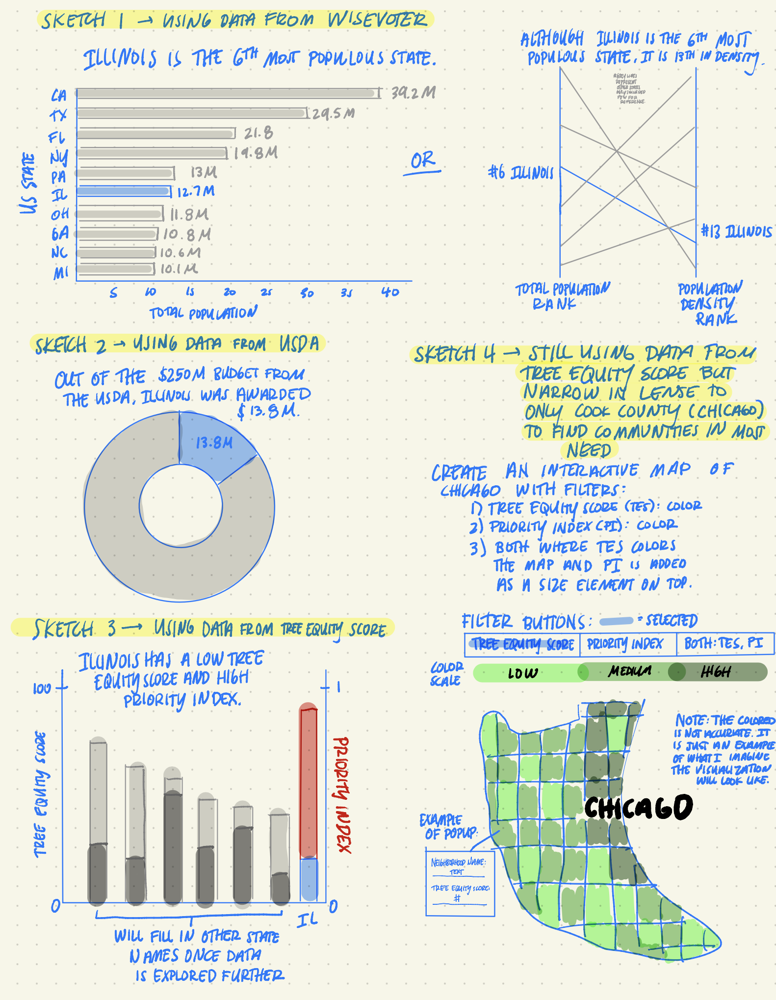

# Final Project Part I
# Promoting Tree Equity in Chicago, Illinois from a Public/Population Health Perspective

## High-level summary of project: 
For this final project, I plan on focusing on promoting tree equity in Chicago. I have conducted previous research on this topic for other classes, but have not had the opportunity to dive deep into the data available. I hope to convey to my audience that this is not only an enviornmental issue but also a population and public health issue. 

Tree Equity is having a proportionate number of trees in a community so that everyone can experience the same health, climate, and economic benefits. Furthermore, Tree canopy is the number of trees located in each neighborhood. Although this is a problem throughout the United States, I was most interested in exploring the issue in Chicago, Illinois, which is my hometown. Recently, it has been discovered within the city of Chicago, trees are not equitably distributed, resulting in an unequal distribution of tree canopy coverage across the city. Instead, they are strategically planted in more affluent and wealthier communities. This is a result of the housing discrimination and discrimination redlining in the 1930s which placed less investment in certain areas because they were categorized as “risky” (Travers, 2021). As an attempt to resolve this issue, Chicago has implemented a new initiative, Our Roots Chicago, to plant 75,000 trees in the next five years in neighborhoods with tree canopy below Chicago’s 16% average (Hunter, 2022). Although this is a step in the right direction, it is still important to raise awarness of this issue especiallly those in historically marginalized and vulnerable communities, so they can work on being more involved in improving the issue. 

- **One line summary:** Although trees provide several health benefits, overtime they have been strategically plan in higher income neighborhoods, causing not all demographics, especially those from historically from marginalized and vulnerable populations, to experience those benefits. 
- **Reader's Perspective:** As a reader, I want to learn my community's tree equity score and priortiy index, so that I can figure out how to better serve the community I live in and ensure we are having the opporutnity to experience the health, climate, and economic benefits of trees.
- **Call to Action:** I can do this by researching more about the Our Roots Chicago Initative and Tree Ambassador Program to figure out how I can get involved in making a postive impact in my community.

## An Outline
- Introduction of Topic
  - Definitions of Tree Equity
  - Definition of Tree Canopy
  - High level Summary
- Start the Topic at Broad Level - Nationally
  - Visualization 1: Introduce Total Population and Population Density of each U.S. state, but specifically 
     highlight where Illinois stands. (Data from [WiseVoter - States by Population](https://wisevoter.com/state-rankings/states-by-population/)
  - Visualization 2: Provide information on the funding given to each state in Fiscal Year of 2023 from the US 
     Department of Agriculture - Urban and Community Forestry Department. (Data from [US Department of Agriculture - Urban and Community Forestry FY 2023 State Allocations](https://www.fs.usda.gov/managing-land/urban-forests/ucf/fy23-state-allocations).
  - Visualization 3: Discuss Tree Equity Score and Priority Index of Each State - focus on the top states, but highlight where Illinois stands. (Data from [Tree Equity Score] (https://www.treeequityscore.org/methodology#3.69/38.45/-100.76)
- Narrow in on Illinois, but speficially the Chicago region. (Data from [Tree Equity Score] (https://www.treeequityscore.org/methodology#3.69/38.45/-100.76)
  - Visualization 4: Find specific communities that have a low tree equity score and high priortiy index score
  - Highlight Reader's Perspective. 
- Call to action
  - Provide resources such Tree Ambassador Program (TREEmendous Lawndale), link to Our Roots Chicago   
     initiative, phone number to call City of Chicago to request planting of a tree in community, and other   
     resources that can help that get involved.
  - Conclude story. 

## Identify primary data sources: 
To bring this story to life, I plan on utilizing publicy acessible data from different sources. Each dataset that I am using provides value to the story that I am building. Below, I will provide a brief description of each dataset and also provide its purpose to telling the story. 
- [WiseVoter - States by Population](https://wisevoter.com/state-rankings/states-by-population/) provides data on the total, male and female, and density of the population in each state. My primary purpose of utlizing this dataset is to showcase the total populaition and population density of Illinois and where it is ranked in the United States. I believe providing this information is vital to the audience to know that Illinois is a very populous state, but most dense in Chicago.
- Once I have establish information on the population in Illinois, I will next provide infomation on how much urban and community forestry funding is allocated Illinois and specifically in what region. I plan to highlight where Illinois ranks in funding in comparison to other US states. The data comes from the [US Department of Agriculture - Urban and Community Forestry FY 2023 State Allocations](https://www.fs.usda.gov/managing-land/urban-forests/ucf/fy23-state-allocations).
- Next, using data from [Tree Equity Score](https://www.treeequityscore.org/methodology#3.69/38.45/-100.76), I plan to use their National and Illinois dataset which both provide information on tree equity, tree canopy, priority index, and other demographic and accessibility information. First, I want to show where Illinois ranks compared to other US states in terms of the tree equity score, but then explore more into the Illinois specific dataset, specifically communities in the Chicago regions and highlight specific disparities that may exist and find which communities need to be prioritized.
- University of Chicago also created a publicly available dashboard using [Carto](https://universityofchicago.carto.com/u/rhabus/builder/7ca40602-e048-41ac-b9a2-4ea4707360a4/embed?state=%7B%22map%22%3A%7B%22ne%22%3A%5B41.7041906065988%2C-87.95860290527345%5D%2C%22sw%22%3A%5B41.9625536359481%2C-87.5054168701172%5D%2C%22center%22%3A%5B41.83350248182098%2C-87.73200988769531%5D%2C%22zoom%22%3A11%7D%2C%22widgets%22%3A%7B%22e877fe88-90a2-41bd-95cc-18d98cb70d91%22%3A%7B%22normalized%22%3Atrue%7D%2C%228b0a20ab-b337-4a6e-a1ac-82379e5569e2%22%3A%7B%22normalized%22%3Atrue%7D%2C%22e0b05dd5-195d-47ef-9e1e-9a884b90978c%22%3A%7B%22normalized%22%3Atrue%7D%2C%22b071640f-0191-43cd-8909-b6359a3a9791%22%3A%7B%22normalized%22%3Atrue%7D%2C%2297490837-b64c-4987-9f0d-6145085029f8%22%3A%7B%22normalized%22%3Atrue%7D%2C%22549c8d25-5942-4cac-ac92-71b498d106b2%22%3A%7B%22normalized%22%3Atrue%7D%2C%22793362e3-01cf-4e8a-bb4c-95c2487df3ae%22%3A%7B%22normalized%22%3Atrue%7D%2C%22f1e84acd-e895-4434-af11-830e727735ea%22%3A%7B%22normalized%22%3Atrue%7D%7D%7D), but the data is not publicly available. I would like to incorporate some of their data if possible since they have data on specific health disparties such as social vulnerablity, but it may not be possible due to lack of access. I thought I would just mention it here just in case. 

## Initial Sketches: 
Here are the some of the visualizations I hope to achieve throughout the development of the project. While creating my final visualization, I realized I should have used green as the consistent color gradient/scale instead of blue for the other visualizations. Green will be used in the future visualizations. 

## Method and Medium: 
To complete my final project, I plan to build my story using Shorthand. The examples of final projects shown in class used Shorthand, but I liked it because it is a platform that is engaging and can easy to navigate for the intended audience. As I was previosuly conducting research on this topic, I found myself visiting a variety of different websites that all shared valueable information. My hope is that by using Shorthand, a user is able to gather most of the information they need on this issue on my platform and feel compelled to learn more and spread awareness about tree equity to others. 

## References: 
- Hunter, K. (2022, Sept 14). Under an Urban Canopy: Chicago’s tree ambassadors teach residents about the crucial role trees play in health and health equity. Chicago Health. Retrieved from https://chicagohealthonline.com/chicago-tree-ambassadors/. 
- Travers, J. (2021, Sept 3). Tree equity. The Ecologist Informed by Nature. Retrieved from https://theecologist.org/2021/sep/03/tree-equity. 
