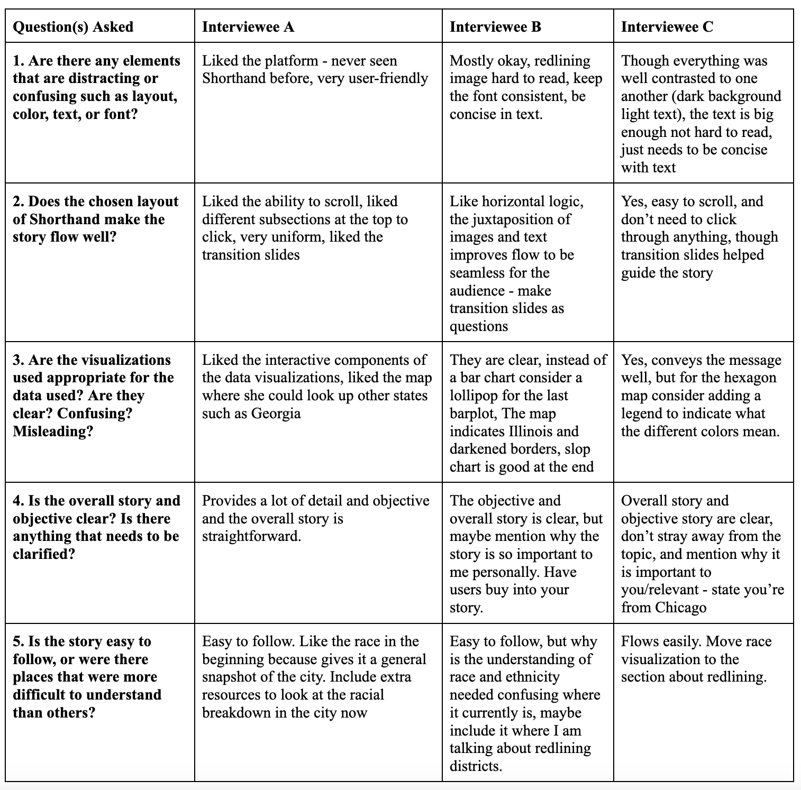
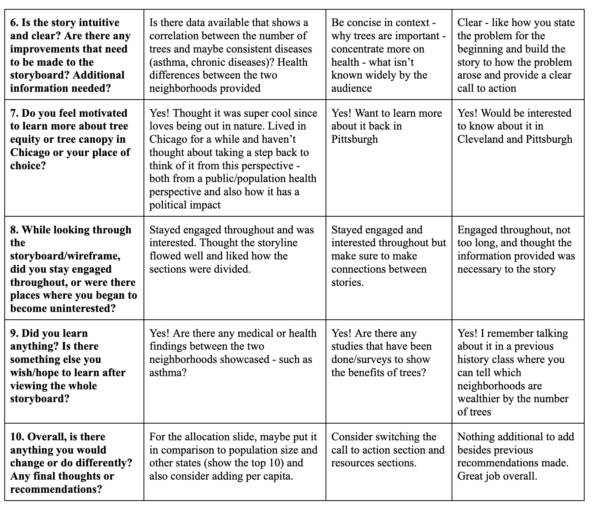
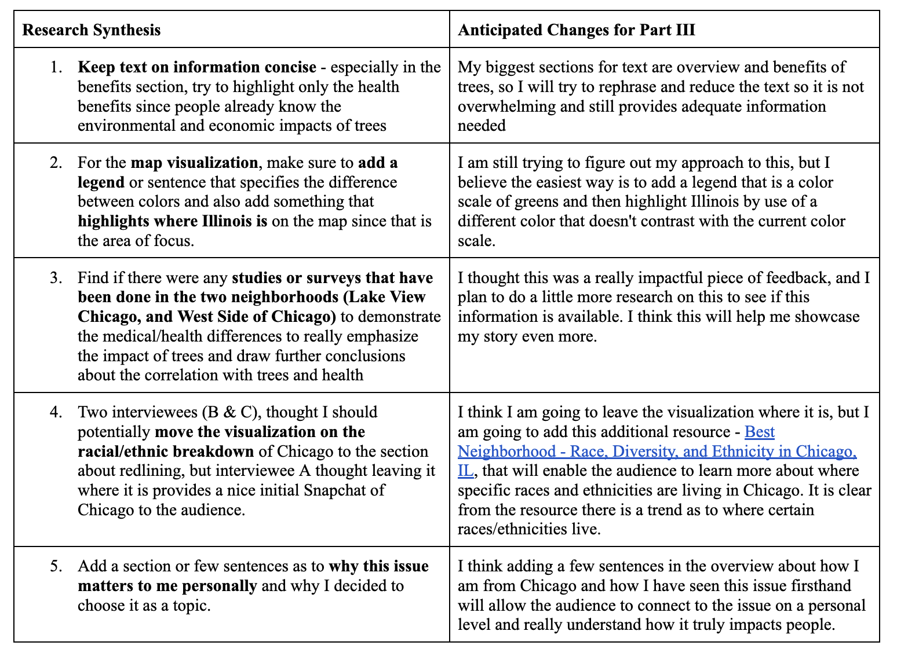

| [home page](https://kavenir.github.io/kavenir-tswd-portfolio/) | [visualizing debt](https://kavenir.github.io/kavenir-tswd-portfolio/visualizing-government-debt.html) | [critique by design](https://kavenir.github.io/kavenir-tswd-portfolio/critique-by-design.html) | [final project I](https://kavenir.github.io/kavenir-tswd-portfolio/final-project-part-one.html) | [final project II](https://kavenir.github.io/kavenir-tswd-portfolio/final-project-part-two.html) | [final project III](https://kavenir.github.io/kavenir-tswd-portfolio/final-project-part-three.html) | [final project deliverable](https://carnegiemellon.shorthandstories.com/promoting-tree-canopy-and-tree-equity-in-chicago/index.html)

# Part II, Final project wireframes / storyboards and user research

## Wireframes / storyboards
To further develop my story outline and relevant components visually through the use of wireframing / storyboards, I decided to directly use Shorthand to get a jump start on the final deliverable and thought it would be the best way to receive the most critical and impactful feedback during my interviews. 

My story outline draft using Shorthand can be viewed below: 

## User research protocol

### Target audience

My intended **target audience** is those who live in the City of Chicago and the surrounding areas as the issue of tree equity and tree canopy are being brought to light more in regards to how trees have been strategically planted in wealthier more affluent neighborhoods instead of distributed equally throughout the city. Although the people of Chicago are my intended audience, I also want my story to reach the general public because not only is it an issue in Chicago, but it exists across the United States. I hope learning more about the issue in Chicago would motivate them to learn more about tree equity and tree canopy in their city.

To **identify representative individuals to interview** based on my intended target audience, I considered three types of individuals: one person that has lived in Chicago and has noticed the issue firsthand, one person who is environmentally conscious (cares about the enviornment), and one who is neutral, meaning they have no prior knowledge about tree canopy or tree equity and see to be indifferent about the enviornment. I also tried to make sure they have had prior experience/knowledge in creating data visualizations so they could provide some useful feedback on my visualizations to ensure they were clear and understandable. The information on my interviewees is as follows: 

- **Interviewee A.** Female (mid-30s) with a business and logistics background who lived in Northern Chicago for 6 years. 
- **Interviewee B.** Male (early-30s) with an information technology, policy, and data analytics background who is environmentally conscious due to previous environmental experiences within his hometown in India. 
- **Interviewee C.** Male (early-20s) with a biomedical engineering and physics background with little prior knowledge of tree equity or tree canopy and is indifferent about the issue. 

### Interview script
In designing my Interview Script, I focused on three main areas (2 of which are from the GoodCharts Critique Method, 1 from GoodCharts Chapter 7):
- Design Execution (Aesthetics, Layout of Shorthand, and Types of Visualizations)
- Contextual Awareness (Clarity, Simplicity, Intuitiveness)
- Persuasion and Manipulation (Motivation, Engagement, Learning Experience) 
- General Question

| Goal                                             | Question(s) to Ask                                                                                                                           |
|--------------------------------------------------|----------------------------------------------------------------------------------------------------------------------------------------------|
| Design Execution: Aesthetics                     | Are there any elements that are distracting or confusing such as layout, color, text, font?                                                  |
| Design Execution: Layout of Shorthand            | Does the chosen layout of Shorthand make the story flow well?                                                                                |
| Design Execution: Types of Visualizations        | Are the visualizations used appropriate for the data used? Are they clear? Confusing? Misleading?                                            |
| Contextual Awareness: Clarity                    | Is the overall story and objective clear? Is there anything you think needs to be clarified more?                                            |
| Contextual Awareness: Simplicity                 | Is the story easy to follow, or were there places that were more difficult to understand than others?                                        |
| Contextual Awareness: Intuitiveness              | Is the story intuitive and clear? Are there any improvements that need to be made to the storyboard? Additional information needed?          |
| Persuasion and Manipulation: Motivation          | Do you feel motivated to learn more about tree equity or tree canopy in Chicago or your place of choice?                                     |
| Persuasion and Manipulation: Engagement          | While looking through the storyboard/wireframe, did you stay engaged throughout or were there places where you began to become uninterested? |
| Persuasion and Manipulation: Learning Experience | Did you learn anything? Is there something else you wish/hope to learn after viewing the whole storyboard?                                   |
| Overall: Final Recommendations/Thoughts          | Overall, is there anything you would change or do differently? Any final thoughts or recommendations?                                        |

### Interview findings
The interviews with Interviewee A and B were conducted virtually while Interviewee C was interviewed in person. During the interview, I gave interviewees 5 minutes to control my storyboard/wireframe, where they could scroll through Shorthand as much as they needed within the allotted time. If they needed more time, I gave them a few more minutes and asked if they were ready to proceed with the questions. 

Details of the findings from my interviews are shared and summarized below:

## Identified changes for Part III

The feedback from the interviewees will be reflected in my final deliverable to address any issues identified. There were mostly similarities in the feedback given from interviews in regards to a clear overall story and objective and thought the content was engaging and interesting, but the main differences were mostly in aesthetics and additional information needed. Conducting a user research protocol was not only helpful in gaining insightful feedback, but also helped expand my lens to view the storyboard and wireframes from different perspectives. 

Although I will try to implement all of the feedback from the interviewees, the five most essential changes that will be implemented next week in my final deliverable from my user research protocol is shared and summarized below: 

I also plan to do more research on the allocation section (as suggested by Interviewee A where I will include another graphic that shows the top 10 states that received the most funding and also consider adding an element that puts the funding into perspective of per capita per population. It was not mentioned in the table since it was only given by only one interviewee, the changes identified above reflect similarities among the interviews. Additionally from the critique covered in class (10/03), I was able to gain some valuable feedback from my peers that I will consider implementing in my final deliverable. They suggested that I move some of the information around such as the history of redlining and side-by-side comparison to the beginning of the storyboard because it really captures the audience's attention and stresses the issue of equitable tree canopy. Additionally, they also mentioned putting the map at the end of the presentation to show that this is not only an issue in Chicago, but nationally, and this way it allows the audience to interact with the map at the end to search their state of choice tree equity information. 

**Overall, I need to make sure to add references/citations for some of the images and information used (so far they are not cited besides the unsplashed ones). I also used additional data to create some of the visualizations, so I need to make sure to cite those as well. All contextual information should already be cited correctly, but I plan to go through everything again to double-check. I also plan to consider just using unsplashed images that are available through shorthand instead of using the ones I found online since I do not want to risk any copyright issues.**  Finally, I will go through my storyboard again to make sure there are no grammatical errors, ensure the text font is consistent throughout, and frame all transitions as questions instead of switching back and forth between questions and statements. 
